# Control Model of appattest-integrator

## 1. Scope

This document models appattest-integrator as a discrete-time control system and protocol orchestration layer.
This is supervisory control over discrete protocol events, not continuous-time feedback control, PID regulation, or signal control.

This document models supervisory control; feedback control (e.g., PID) is introduced separately as an optional reliability mechanism layered on top.

The model characterizes:
- Discrete-time state accumulation over protocol events
- Deterministic constraint enforcement on state transitions
- Observation of accumulated state without state mutation
- Verbatim forwarding of external subsystem responses

Out of scope:
- Cryptographic verification mechanisms
- Trust and authorization decisions
- Policy evaluation
- Continuous-time dynamics
- Implementation-level concerns

This document provides conceptual and analytical context.
System correctness does not depend on understanding this model.

## 2. System Boundary and Decomposition

The system is decomposed into four orthogonal subsystems, with the integrator operating strictly in the control plane.

**Control-plane components**
- **appattest-integrator**
  Discrete-time state accumulator, sequence enforcer, and observation surface.
- **appattest-backend**
  Cryptographic verification and binding enforcement authority.

**Data-plane components**
- **appattest-decoder**
  Structural parsing of protocol artifacts.
- **appattest-validator**
  Cryptographic verification primitives.

**External actors**
- Product backends: initiate flows, consume observations.
- Mobile clients: generate protocol events.

The integrator does not interpret cryptographic artifacts.
It forwards them unchanged and accumulates protocol-level state only.

## 3. Inputs, Outputs, and State

### Discrete-time index

Time advances in event time, not wall-clock time.

$$ t \in \mathbb{N}, \quad t \mapsto \text{protocol event} $$

There is no continuous-time signal $x(t)$.

### Inputs $u(t)$

$$ u(t) \in \mathcal{U} $$

Where $\mathcal{U}$ includes:

- Flow initiation events:

$$
u_{\texttt{start}} =
(\texttt{keyID}, \texttt{attestationObject}, \texttt{verifyRunID?})
$$

Where:
- `keyID` is the App Attest key identifier
- `attestationObject` is the attestation artifact
- `verifyRunID` is optional

- ClientDataHash requests:

$$
u_{\texttt{hash}} =
(\texttt{flowHandle}, \texttt{verifyRunID?})
$$

Where:
- `flowHandle` is the integrator-scoped handle
- `verifyRunID` is optional

- Assertion submissions:

$$
u_{\texttt{assert}} =
(\texttt{flowHandle}, \texttt{assertionObject}, \texttt{verifyRunID?})
$$

Where:
- `flowHandle` identifies the flow
- `assertionObject` is the assertion artifact
- `verifyRunID` is optional

- State observation queries:

$$
u_{\texttt{status}} =
(\texttt{flowHandle})
$$

### Outputs $y(t)$

$$ y(t) \in \mathcal{Y} $$

Including:

- State observations:

$$
y_{\texttt{state}} =
(\texttt{flowHandle}, \texttt{flowID}, s, t_{\texttt{terminal}}, \tau)
$$

Where:
- `flowHandle` is the integrator handle
- `flowID` is the backend-authored identifier
- $s$ is the protocol state
- $t_{\texttt{terminal}}$ indicates terminal status
- $\tau$ represents timestamps

- Backend responses:

$$
y_{\texttt{backend}} = r(t)
$$

Where:
- $r(t)$ is the verbatim backend JSON response

- Deterministic error signals:

$$
y_{\texttt{error}} \in
\{\texttt{sequence\_violation}, \texttt{expired},
\texttt{not\_found}, \ldots\}
$$

Where error codes include `sequence_violation`, `expired`, `not_found`, etc.

### State $x(t)$

For each flowHandle $h$:

$$ x_h(t) = \begin{bmatrix} \text{state}_h \\ \text{flowID}_h \\ \text{keyID}_h \\ \text{verifyRunID}_h \\ \text{timestamps}_h \\ \text{lastBackendStatus}_h \end{bmatrix} $$

Where `verifyRunID` is optional and `lastBackendStatus` stores backend-reported status.

Global auxiliary state:
- Metrics counters
- Correlation identifiers

## 4. State Evolution (Discrete Accumulation)

State evolves according to:

$$ x(t+1) = f\big(x(t), u(t), r(t)\big) $$

Where:
- $f$ is deterministic
- $r(t)$ is the backend response (if invoked)
- Past state is immutable
- State history is append-only in effect

Terminal states impose:

$$ x(t+1) = x(t) \quad \forall u(t) \text{ that mutate state} $$

## 5. Discrete-Time Integrator Analogy (Supervisory, Not Linear)

This system behaves analogously to a discrete-time integrator, but over protocol state, not signal amplitude.

**Continuous-time integrator (for reference)**

$$ H(s) = \frac{1}{s} $$

**Discrete-time signal integrator**

$$ x[k+1] = x[k] + u[k] $$

**Protocol-state integrator (this system)**

$$ x(t+1) = \begin{cases} f(x(t), u(t), r(t)) & \text{if transition valid} \\ x(t) & \text{if transition invalid} \end{cases} $$

Key differences:
- No linear superposition
- No scalar accumulation
- State space is finite and symbolic
- Integration occurs over event history
- No continuous-time transfer functions

This is not signal processing or linear control.
It is discrete protocol-state accumulation under supervisory constraints.

## 6. State Transitions as Hard Constraints

The state machine defines a constraint surface.

**Valid transitions**

$$
\text{created} \rightarrow \text{registered}
$$

$$
\text{registered} \rightarrow \text{hash-issued}
$$

$$
\text{hash-issued} \rightarrow \text{verified} \;\;|\;\; \text{rejected}
$$

$$
\forall s \rightarrow \text{expired}
$$

**Constraint violations**

Invalid transition $u(t)$ from state $x(t)$ yields:

$$ y(t) = \text{error}(x(t), u(t)) $$

and:

$$ x(t+1) = x(t) $$

No heuristics.
No recovery.
No implicit correction.

## 7. Feedback and Observation

### Feedback paths
- Backend response feedback
  $$ r(t) \rightarrow x(t+1) $$
- Time-based expiration
  $$ \text{now} > \text{expiresAt} \Rightarrow \text{expired} $$

Where `expiresAt` is a timestamp field in state.
- Violation counters increment metrics

### Explicitly absent feedback
- Authorization outcomes
- Trust assessments
- Policy decisions

These signals do not exist in this system.

### Observation operator

Define an observation function:

$$ y(t) = g(x(t)) $$

Where:
- $g$ is read-only
- $\frac{\partial x}{\partial y} = 0$ (no observer back-action)
- Observation does not affect state

## 8. Stability and Termination

Terminal states are absorbing states:

$$ x(t) \in \{\text{verified}, \text{rejected}, \text{expired}, \text{error}\} \Rightarrow x(t+1) = x(t) $$

Where terminal states are: `verified`, `rejected`, `expired`, `error`.

The system is bounded-input, bounded-state.

$$ |\mathcal{X}| < \infty \;\Rightarrow\; x(t) \in \mathcal{X} \;\forall t $$

Liveness is not guaranteed:
- Flows may stall
- TTL enforces eventual termination

This is intentional.

## 9. Formal Non-Goals

The system explicitly excludes:

$$
\text{Cryptographic verification}
$$

$$
\text{Trust decisions}
$$

$$
\text{Authorization logic}
$$

$$
\text{Policy evaluation}
$$

$$
\text{Freshness guarantees beyond TTL}
$$

$$
\text{Replay prevention beyond backend semantics}
$$

These responsibilities belong to other subsystems.

## 10. Control-System Block Diagram

```mermaid
flowchart TB
    subgraph External["External Actors"]
        MC[Mobile Client<br/>Protocol Events]
    end
    
    subgraph Control["Control Plane"]
        PB[Product Backend<br/>Policy / Logic]
        INT["appattest-integrator<br/>
State: x<br/>
State update: f(x,u,r)<br/>
Observation: g(x)"]
    end
    
    subgraph Data["Data Plane"]
        BE[appattest-backend<br/>VERIFICATION AUTHORITY]
        DP[Decoder / Validator<br/>Parsing • Crypto Primitives]
    end
    
    MC -->|"u(t)"| PB
    PB -->|"u(t)"| INT
    INT -->|"r(t)"| BE
    BE --> DP
    INT -->|"y(t)"| PB
    
    style INT fill:#e1f5ff,stroke:#01579b,stroke-width:2px
    style BE fill:#fff3e0,stroke:#e65100,stroke-width:2px
    style DP fill:#f3e5f5,stroke:#4a148c,stroke-width:2px
```

**Key properties:**
- Single accumulation point
- No algebraic loops
- Feedback enters only via backend responses $r(t)$
- No decision loops inside the integrator
- Supervisory control structure

## 11. Formal Constraints

### Transition Constraint Set

Define the set of valid state transitions:

$$ \mathcal{T} = \{(\text{created}, \text{registered}), (\text{registered}, \text{hash-issued}), (\text{hash-issued}, \text{verified}), (\text{hash-issued}, \text{rejected}), (s, \text{expired}) : s \in \mathcal{S}\} $$

Where state names are: `created`, `registered`, `hash_issued`, `verified`, `rejected`, `expired`, `error`.

Where $\mathcal{S}$ is the set of all non-terminal states.

### Hard Constraint Enforcement

For any input $u(t)$ and current state $x(t)$:

$$ x(t+1) = \begin{cases} f(x(t), u(t), r(t)) & \text{if } (x(t), u(t)) \in \mathcal{T} \\ x(t) & \text{if } (x(t), u(t)) \notin \mathcal{T} \end{cases} $$

Invalid transitions yield deterministic error signals:

$$ y(t) = \text{error}(x(t), u(t)) \quad \text{when } (x(t), u(t)) \notin \mathcal{T} $$

### Terminal State Absorption

Define terminal states:

$$ \mathcal{X}_T = \{\text{verified}, \text{rejected}, \text{expired}, \text{error}\} $$

Terminal states: `verified`, `rejected`, `expired`, `error`.

Terminal states are absorbing:

$$ x(t) \in \mathcal{X}_T \Rightarrow x(t+1) = x(t) \quad \forall u(t) $$

### Observer Constraint

The observation operator $g$ satisfies:

$$ y(t) = g(x(t)), \quad \frac{\partial x}{\partial y} = 0 $$

Observation queries do not affect state evolution:

$$ x(t+1) = f(x(t), u(t), r(t)) \quad \text{independent of } y(t') \text{ for } t' \le t $$

### Boundedness Constraint

State space is finite and symbolic:

$$ |\mathcal{X}| < \infty $$

Bounded-state property:

$$ |\mathcal{X}| < \infty \;\Rightarrow\; x(t) \in \mathcal{X} \;\forall t $$

State space $\mathcal{X}$ is finite and symbolic.

## 12. Interpretation Notes

This is one valid analytical lens.

Equivalent interpretations:
- Protocol state machine
- Control-plane orchestrator
- Correlation and sequencing service

The control-theoretic framing is descriptive, not performative.
The system functions identically without it.
